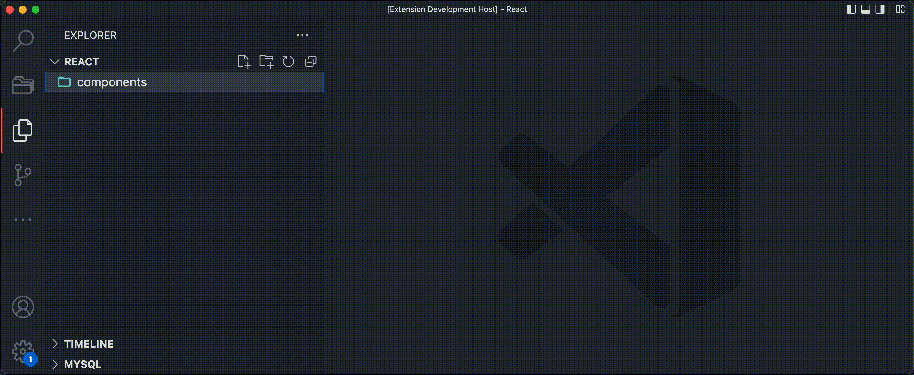

# webbio-react-tools README

Collection of tools and snippets to optimize the Webbio workflow.

## Requirements

The extension offers templates for [CSS modules](https://create-react-app.dev/docs/adding-a-css-modules-stylesheet/) and [Styled Components](https://styled-components.com/).
The CSS modules only work in a project that has SCSS compiling setup correctly. Likewise Styled Components only works if the correct packages are installed within the project.

The templates need the following Typescript helper type to function correctly:

```ts
import { ReactElement } from "react";

declare global {
	type ReactComponent<T = Record<string, any>> = {
		(props: T): ReactElement | null;
		displayName?: string;
	};
}
```

This can be added in a `global.d.ts` file.

## Features

A simple but extensive list of snippets specified to the needs of Webbio. The snippets include React, Styled-Components, Redux, NextJS and more.

Also included; a small extension to the explorer sidebar context menu. This extension makes it a breeze to add new typed (styled) React components.

### Explorer context menu

Extension to the explorer context menu where you can add a React component to the selected directory. It's possible to create a functional React component (Typescript) with:

-   a styled components style file.
-   a CSS module file (scss).
-   an index file with default exports.



### Snippets

| Snippet       | Renders                                                         |
| ------------- | --------------------------------------------------------------- |
| `imn`         | Import                                                          |
| `imp`         | Import default                                                  |
| `imd`         | Import deconstructed                                            |
| `ime`         | Import all as alias                                             |
| `ima`         | Import named as alias                                           |
| `exa`         | Export all                                                      |
| `exp`         | Export default                                                  |
| `exd`         | Export deconstructed                                            |
| `exn`         | Export alias                                                    |
| `nfn`         | Typescript function                                             |
| `dob`         | Destruct object variable                                        |
| `dar`         | Destruct array variable                                         |
| `sto`         | Timeout                                                         |
| `sti`         | Interval                                                        |
| `cl`          | Console log                                                     |
| `imr`         | Import React                                                    |
| `imrs`        | Import React and useState                                       |
| `imre`        | Import React and useEffect                                      |
| `imrse`       | Import React, useState and useEffect                            |
| `rc`          | React (Typescript) functional component                         |
| `rcr`         | React (Typescript) functional component with return             |
| `rsc`         | React (Typescript) styled functional component                  |
| `rscr`        | React (Typescript) styled functional component with return      |
| `usestate`    | React (Typescript) state hook                                   |
| `useeffect`   | React (Typescript) effect hook                                  |
| `ruseeffect`  | React (Typescript) effect hook with return                      |
| `cref`        | React (Typescript) create reference                             |
| `impdis`      | Redux import useDispatch                                        |
| `usedispatch` | Redux useDispatch as const                                      |
| `rxslice`     | Redux slice                                                     |
| `rxconst`     | Redux const                                                     |
| `rxselect`    | Redux selector const                                            |
| `impint`      | React Intl import useIntl                                       |
| `useintl`     | React Intl useIntl as const                                     |
| `imsc`        | import styled from 'styled-components'                          |
| `imscg`       | import { createGlobalStyle } from 'styled-components'           |
| `imsccss`     | import styled, { css } from 'styled-components'                 |
| `imcss`       | import { css } from 'styled-components'                         |
| `imsct`       | import { withTheme } from 'styled-components'                   |
| `sc`          | Export styled-component                                         |
| `scc`         | Export styled-component from existing component                 |
| `scattrs`     | Export styled-component with attributes                         |
| `sccattrs`    | Export styled-component with attributes from existing component |
| `scpt`        | Use props.theme inside styled-component                         |
| `scp`         | Use props inside styled-component                               |
| `scpd`        | Use props inside styled-component (destructured)                |

## Release Notes

### 1.0.0

Initial release
